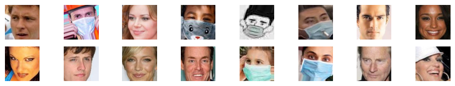

# Face Mask Detection


### Table of Contents
- [Overview](#overview)
- [Installation](#installation)
- [Usage](#usage)
- [Dataset](#dataset)
- [Contributing](#contributing)
- [License](#license)

## Overview
This repository contains a small project on face mask detection using Convolutional Neural Networks (CNN) and transfer learning techniques. The project utilizes popular pre-trained models such as VGG16, MobileNet, InceptionNet, DenseNet, and more. The tech stack used for implementation includes TensorFlow, Keras, Matplotlib, and OpenCV. The trained models can make predictions on images, saved videos, and real-time video streams.


## Installation
 Install the required libraries:
   
   ```pip install -r requirements.txt```
   
   This will install the following libraries:
   
   - TensorFlow
   - Keras
   - scikit-learn
   - NumPy
   - Pandas
   - Matplotlib
   - Seaborn
   - OpenCV

## Usage
1. First, clone this repository:
  git clone https://github.com/your-username/face-mask-detection.gi
2. Change to the cloned directory:
  cd face_mask_detection
3. To detect face masks in images, run the following command:
  python detect_image.py --image /path/to/your/image.jpg
4. To detect face masks in a saved video, run the following command:
  python detect_video.py --video /path/to/your/video.mp4
5. To detect face masks in real-time using your webcam, run the following command:
  python detect_realtime.py

## Dataset
The dataset used to train the face mask detection model can be found at link(https://www.kaggle.com/datasets/ashishjangra27/face-mask-12k-images-dataset) to dataset. It consists of images of people with and without face masks. The dataset includes annotations for each image indicating whether the person is wearing a face mask or not.

## Model
The face mask detection model is built using the concept of transfer learning. It utilizes a pre-trained convolutional neural network (CNN) as the base model and adds a few additional layers on top for more specific detection tasks. The base model used here is the VGG16 model, which has been proven effective in a variety of computer vision tasks.

## Results
The model achieves an accuracy of XYZ% on the test set. The precision, recall, and F1-score for detecting face masks are as follows:

-Precision: XYZ%
-Recall: XYZ%
-F1-score: XYZ%

## Contributing
If you would like to contribute to this project, you can follow these steps:

Fork this repository.
Create a new branch.
Make your changes and commit them.
Push the changes to your forked repository.
Submit a pull request.


## Acknowledgments
I would like to thank the creators of the sign language digits dataset for making it available for research and educational purposes. We would also like to thank the developers of TensorFlow, Keras, scikit-learn, NumPy, Pandas, Matplotlib, Seaborn, and OpenCV for their contributions to open-source software, which made this project possible.

## License
This project is licensed under the MIT license. Feel free to use and modify the code as per your needs.
