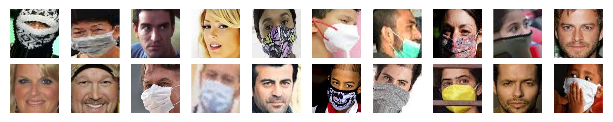

# Face Mask Detection


### Table of Contents
- [Overview](#overview)
- [Installation](#installation)
- [Usage](#usage)
- [Dataset](#dataset)
- [Model](#model)
- [Acknowledgments](#acknowledgments)

## Overview
This repository contains a small project on face mask detection using Convolutional Neural Networks (CNN) and transfer learning techniques. The project utilizes popular pre-trained models such as VGG16, MobileNet, InceptionNet, DenseNet, and more. The tech stack used for implementation includes TensorFlow, Keras, Matplotlib, and OpenCV. The trained models can make predictions on images, saved videos, and real-time video streams.

## Installation

1. Clone the repository:

   ```git clone https://github.com/tajammulbasheer/face-mask-detection.git```
   
2. Navigate to the project directory:

   ```cd face-mask-detection```
   
3. Create a new virtual environment:
   
   ```python -m venv env```
  
4. Activate the virtual environment:
   - On Windows:
   
     ```env\Scripts\activate```
     
   - On Linux or macOS:
    
     ```source env/bin/activate```

5. Install the required libraries:
   
   ```pip install -r requirements.txt```
   
   This will install the following libraries:
   
   - TensorFlow
   - Keras
   - scikit-learn
   - NumPy
   - Pandas
   - Matplotlib
   - Seaborn
   - OpenCV
   
6. Download the dataset:

   Download the Face Mask Dataset from [here](https://www.kaggle.com/datasets/ashishjangra27/face-mask-12k-images-dataset) on kaggle and extract it to the `dataset` directory.

   The dataset should be organized as follows in side the main directory:
   
   ````
   dataset/Face Mask Dataset
   ├── Train/
   │   ├── 0.jpg
   │   ├── 1.jpg
   │   ├── ...
   ├── Test/
   │   ├── 0.jpg
   │   ├── 1.jpg
   │   ├── ...
   ├── Valid
   │   ├── 0.jpg
   │   ├── 1.jpg
   │   ├── ...
   ```

   
7. Run the Jupyter notebooks:

   ```jupyter notebook```

   This will open a new browser window with the list of Jupyter notebooks in the project. You can then open and run the notebooks to train and evaluate the different machine learning models and explore the dataset.

   Note that some of the notebooks may take a long time to run, especially those that involve training deep learning models. You may want to use a GPU for faster training, or use pre-trained models instead.


## Usage
This project was createdd to apply the concepts of transfer learning on real world problems.
After properly settting up the system following installation above you can open the notebooks and explore them.


## Dataset
The dataset used to train the face mask detection model can be found at [link](https://www.kaggle.com/datasets/ashishjangra27/face-mask-12k-images-dataset) to dataset. It consists of images of people with and without face masks. The dataset includes partationing images into train, test, valid sets and further more each set has seperate folders for masked faces and non masked face images.

## Model
The face mask detection model is built using the concept of transfer learning. It utilizes a pre-trained convolutional neural network (CNN) as the base model and adds a few additional layers on top for more specific detection tasks. The base model used here is the VGG19 model, which has been proven effective in a variety of computer vision tasks.


## Acknowledgments
I would like to thank the creators of face mask dataset for making it available for research and educational purposes. We would also like to thank the developers of TensorFlow, Keras, scikit-learn, NumPy, Pandas, Matplotlib, Seaborn, and OpenCV for their contributions to open-source software, which made this project possible.

